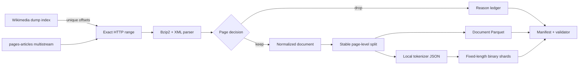

# Wikipedia ML Data Pipeline

[](https://github.com/edcadet10/wikipedia-ml-data-pipeline/actions/workflows/ci.yml)
[](https://github.com/edcadet10/wikipedia-ml-data-pipeline/actions/workflows/codeql.yml)
[](LICENSE)
[](pyproject.toml)
[](CONTRIBUTING.md)

An auditable path from Wikimedia's compressed XML dumps to document-level Parquet
and optional fixed-length token shards. Every emitted record retains provenance;
every dropped page has a reason; every artifact is hash-linked from a manifest.

> **Current scope — v0.1:** a tested vertical slice for one independently compressed
> `pages-articles-multistream` segment. Full-dump orchestration, semantic extraction
> accuracy, and corpus-level quality are explicit validation targets—not current claims.

## Why this exists

“Convert Wikipedia into training data” hides the engineering work that determines
whether a dataset is reproducible or trustworthy: mutable sources, compressed-stream
boundaries, wiki markup, document leakage, tokenizer identity, interrupted jobs,
silent exclusions, and content licensing.

This repository makes those decisions inspectable. It is both a practical data tool
and an open research-engineering project where benchmark results, parser edge cases,
and design critiques can be reviewed in public.

## What the vertical slice does

- reads Wikimedia's compressed multistream index and resolves an exact byte range;
- rejects servers that ignore or alter the requested HTTP range;
- parses latest-revision namespace-zero pages from a genuine bzip2 stream;
- records redirects, non-article namespaces, invalid pages, and empty text as explicit drops;
- normalizes wikitext while preserving paragraph boundaries and source identifiers;
- assigns whole documents to splits with a stable hash of `page_id`;
- writes a declared Apache Parquet schema with canonical logical-content hashes;
- optionally packs a local, hash-pinned tokenizer JSON into little-endian token shards;
- validates hashes, schema, page accounting, split assignment, shard shape, and token bounds;
- publishes no output directory until those mechanical checks pass.

## Architecture



The full data contract and trust boundaries are documented in
[`docs/data-contract.md`](docs/data-contract.md) and
[`docs/architecture.md`](docs/architecture.md).

## Quick start

Requirements: Python 3.11+ and [uv](https://docs.astral.sh/uv/).

```bash
git clone https://github.com/edcadet10/wikipedia-ml-data-pipeline.git
cd wikipedia-ml-data-pipeline
uv sync --locked --all-groups

# Download and process one current Simple English Wikipedia stream.
uv run wikiml probe --output artifacts/simplewiki-stream-0

# Independently re-check every declared artifact.
uv run wikiml validate artifacts/simplewiki-stream-0

# Inspect exact source offsets, hashes, transformations, counts, and claims.
uv run wikiml inspect artifacts/simplewiki-stream-0
```

`latest` is intentionally marked mutable in the manifest. For an archival experiment,
pass a dated Wikimedia snapshot:

```bash
uv run wikiml probe \
  --wiki simplewiki \
  --snapshot YYYYMMDD \
  --stream 0 \
  --output artifacts/simplewiki-YYYYMMDD-stream-0
```

### Optional token shards

Tokenization never silently downloads a model asset. Supply a local Hugging Face
`tokenizer.json` and its EOS token ID; the tokenizer file's SHA-256 becomes part of
the dataset manifest.

```bash
uv run wikiml probe \
  --output artifacts/simplewiki-tokenized \
  --tokenizer-json /absolute/path/to/tokenizer.json \
  --eos-token-id 50256 \
  --context-length 1024 \
  --sequences-per-shard 4096
```

Binary files contain contiguous little-endian `uint16` or `uint32` token IDs and can
be memory-mapped without a framework-specific serialization layer:

```python
from pathlib import Path

from wikiml.loader import TokenShard

shard = TokenShard(
    Path("artifacts/simplewiki-tokenized/tokens/train-00000.bin"),
    dtype="uint16-le",
    context_length=1024,
)
first_sequence = shard[0]
```

## Output contract

```text
dataset/
├── documents.parquet       # canonical document rows
├── dropped-pages.jsonl     # every exclusion and its reason
├── manifest.json           # source, configuration, hashes, counts, and claim scope
└── tokens/                 # present only when tokenization is requested
    ├── train-00000.bin
    ├── validation-00000.bin
    └── test-00000.bin
```

Each Parquet row contains:

| Field | Meaning |
|---|---|
| `wiki` | Source Wikimedia database, such as `simplewiki` |
| `page_id` | Stable page identifier used for split assignment |
| `revision_id` | Exact latest revision represented in the dump |
| `revision_timestamp` | Source revision timestamp |
| `title`, `url` | Human-readable identity and attribution path |
| `text` | Normalized extracted text |
| `text_sha256` | Hash of the normalized UTF-8 text |
| `split` | Deterministic `train`, `validation`, or `test` assignment |
| `license` | Source-content license identifier |

## Validation and claims policy

`wikiml validate` exhaustively checks mechanical invariants declared by the manifest.
It does **not** convert those checks into claims about semantic extraction quality,
population-wide deduplication, model quality, or legal compliance.

Before this project claims full-dump reliability, the acceptance work in
[`docs/validation.md`](docs/validation.md) requires a dated checksum-pinned source,
complete page accounting, cross-worker reproducibility, interruption recovery,
stratified extraction review, leakage tests, and a training-loader smoke test.

## Development

```bash
uv run ruff format --check .
uv run ruff check .
uv run mypy
uv run pytest --cov --cov-report=term-missing
uv build --clear
uv run twine check --strict dist/*
uv export --locked --no-emit-project --all-groups --format requirements-txt | uv run pip-audit --strict -r /dev/stdin
```

CI runs the same gates from the committed lockfile. Actions are pinned to immutable
commit SHAs and receive minimum token permissions. See
[`CONTRIBUTING.md`](CONTRIBUTING.md) for the contribution workflow.

## Collaboration

Bug reports, extraction fixtures, benchmark results, tokenizer adapters, design
reviews, and falsifying examples are welcome. Use
[Issues](https://github.com/edcadet10/wikipedia-ml-data-pipeline/issues) for actionable
work and [Discussions](https://github.com/edcadet10/wikipedia-ml-data-pipeline/discussions)
for open-ended proposals and research questions.

## Data and licensing

The source code is licensed under [Apache-2.0](LICENSE). Wikipedia text has separate
license and attribution requirements; generated artifacts are not relicensed by the
code license. Read [`DATA_LICENSE.md`](DATA_LICENSE.md) before redistributing Parquet
or token shards. This repository does not bundle a Wikipedia corpus.

## Technical basis

- [Wikimedia data dumps](https://meta.wikimedia.org/wiki/Data_dumps)
- [Wikimedia User-Agent policy](https://foundation.wikimedia.org/wiki/Policy:Wikimedia_Foundation_User-Agent_Policy)
- [Apache Arrow Parquet documentation](https://arrow.apache.org/docs/python/parquet.html)
- [Hugging Face Tokenizers](https://huggingface.co/docs/tokenizers/)
