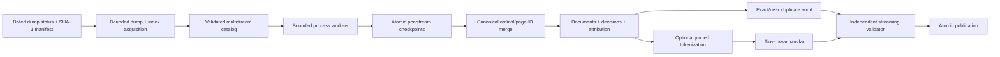

# Wikipedia ML Data Pipeline

[](https://github.com/edcadet10/wikipedia-ml-data-pipeline/actions/workflows/ci.yml)
[](https://github.com/edcadet10/wikipedia-ml-data-pipeline/actions/workflows/codeql.yml)
[](LICENSE)
[](pyproject.toml)
[](CONTRIBUTING.md)

A restartable, auditable path from Wikimedia's compressed XML dumps to
document-level Parquet and optional fixed-length token shards. Every emitted record
retains revision provenance, every indexed page has a decision, and every published
artifact is hash-linked from a manifest.

> **Qualification status — v0.2:** complete dated-dump orchestration and exhaustive
> mechanical validation are implemented. Human semantic and licensing reviews remain
> separate release gates; the software does not turn a finite review into a corpus-wide
> quality or legal-compliance claim.

## Why this exists

“Convert Wikipedia into training data” hides the engineering decisions that determine
whether the result can be reproduced or trusted: mutable sources, compressed-stream
boundaries, wiki markup, interrupted jobs, split leakage, tokenizer identity, silent
exclusions, and content licensing.

This project makes those decisions inspectable through checksums, checkpoints,
deterministic merge order, adversarial tests, independent validation, data cards, and
explicit claim boundaries.

## What v0.2 does

- requires a dated Wikimedia snapshot and verifies the complete dump and index against
  Wikimedia's published SHA-1 manifest;
- downloads the dump with a hard byte bound and processes independently compressed
  streams with bounded process concurrency;
- commits one validated, identity-bound checkpoint per stream and resumes idempotently;
- compares XML page order with every page ID in the bundled multistream index;
- records an `emitted` or declared `dropped` decision for every indexed page;
- reparses once after removing declared non-prose links, tables, reference blocks, and
  boilerplate sections, then explicitly drops structurally ambiguous markup residue;
- retains normalized text only when it contains at least three alphabetic words;
- assigns whole pages to stable splits using a seeded hash of `page_id`;
- merges in canonical source order regardless of worker completion order;
- writes document, attribution, source-index, stream, decision, audit, and data-card
  artifacts before atomically publishing the output directory;
- optionally tokenizes from Parquet with a local, bundled, SHA-256-pinned tokenizer and
  runs a tiny NumPy bigram-training smoke test;
- independently streams every artifact back through a schema-v2 validator.

## Architecture



See [the architecture](docs/architecture.md), [data contract](docs/data-contract.md),
and [acceptance policy](docs/validation.md) for the exact trust boundaries.

## Quick start

Requirements: Python 3.11+ and [uv](https://docs.astral.sh/uv/).

```bash
git clone https://github.com/edcadet10/wikipedia-ml-data-pipeline.git
cd wikipedia-ml-data-pipeline
uv sync --locked --all-groups

# Small network and format probe: one independently compressed stream.
uv run wikiml probe --output artifacts/simplewiki-stream-0
uv run wikiml validate artifacts/simplewiki-stream-0
```

### Complete dated-dump build

Full builds reject `latest`; provide an immutable snapshot date and keep the work
directory outside the output directory. The work directory holds the verified dump
and restart checkpoints.

```bash
uv run wikiml build \
  --wiki simplewiki \
  --snapshot YYYYMMDD \
  --workers 4 \
  --work-dir artifacts/work/simplewiki-YYYYMMDD \
  --output artifacts/simplewiki-YYYYMMDD

# Re-run the exhaustive validator without trusting the build process.
uv run wikiml validate artifacts/simplewiki-YYYYMMDD
uv run wikiml inspect artifacts/simplewiki-YYYYMMDD
```

If a run stops, repeat the same command. Every reused checkpoint is revalidated against
the source segment, source-index page IDs, build identity, split rule, schemas, counts,
and hashes. `--discard-work` removes checkpoints after publication; output and work
paths must be disjoint in both nesting directions.

For a deliberate restart test, use one worker and inject a stop after completed streams:

```bash
uv run wikiml build \
  --wiki simplewiki --snapshot YYYYMMDD --workers 1 \
  --fail-after-streams 100 \
  --work-dir artifacts/work/restart-test \
  --output artifacts/restart-test
```

That command must fail without publishing an output. Resume without
`--fail-after-streams`, optionally with a different worker count.

### Optional token shards

Tokenization never silently downloads a model asset. Supply a local Hugging Face
`tokenizer.json` and its EOS token ID. The tokenizer is copied into the dataset and its
SHA-256, byte count, vocabulary size, and EOS ID become part of the manifest.

```bash
uv run wikiml build \
  --wiki simplewiki --snapshot YYYYMMDD \
  --work-dir artifacts/work/simplewiki-tokenized \
  --output artifacts/simplewiki-tokenized \
  --tokenizer-json /absolute/path/to/tokenizer.json \
  --eos-token-id 50256 \
  --context-length 1024 \
  --sequences-per-shard 4096
```

Shards are contiguous little-endian `uint16` or `uint32` token IDs and can be
memory-mapped without framework-specific serialization:

```python
from pathlib import Path

from wikiml.loader import TokenShard

shard = TokenShard(
    Path("artifacts/simplewiki-tokenized/tokens/train-00000.bin"),
    dtype="uint16-le",
    context_length=1024,
)
first_sequence = shard[0]
```

## Full-build output

```text
dataset/
├── DATA_CARD.md                     # source, transformations, limitations, licensing
├── attribution.parquet              # revision-level attribution without training text
├── corpus-audit.json                # exhaustive exact + bounded near-duplicate results
├── documents.parquet                # canonical document rows
├── dropped-pages.jsonl              # explicit exclusions and reasons
├── manifest.json                     # source, configuration, hashes, counts, claims
├── page-decisions.parquet            # one decision for every source-index page ID
├── semantic-review-candidates.jsonl  # deterministic 10-per-length-stratum packet
├── source-index.txt.bz2              # exact index used for page accounting
├── streams.jsonl                     # every source range and checkpoint summary
├── tokenizer.json                    # present only for tokenized builds
└── tokens/                            # present only for tokenized builds
    ├── train-00000.bin
    ├── validation-00000.bin
    └── test-00000.bin
```

## Claims and review policy

`wikiml validate` exhaustively checks the declared mechanical invariants. It does not
establish population-wide semantic accuracy, eliminate every content-level leakage
mode, demonstrate model quality, or provide legal advice.

The pre-registered full acceptance gate requires a real dated run, injected failure
and resume, a clean second-environment reproduction, exact and sampled duplicate
probes, every-shard scanning, tiny-model training, independent engineering review,
and separate human semantic/licensing decisions. See [validation](docs/validation.md)
and the [review protocol](docs/review-protocol.md).

After a human records all 30 decisions in the protocol's separate JSONL format, verify
completeness, revision identity, labels, and the sample-limited conclusion with:

```bash
uv run wikiml review-semantic artifacts/simplewiki-YYYYMMDD decisions.jsonl
```

## Development

```bash
make check
docker build -f Dockerfile.repro -t wikiml-repro .
docker run --rm --user 65534:65534 wikiml-repro --version
```

The check target runs formatting, linting, strict type checking, branch-aware tests
with a 90% coverage floor, package build and metadata checks, and a locked dependency
audit. CI tests Python 3.11, 3.12, and 3.13. Actions and the reproducibility container
base are pinned to immutable revisions.

## Collaboration

Bug reports, extraction fixtures, falsifying examples, benchmarks, data reviews, and
design critiques are welcome. Use
[Issues](https://github.com/edcadet10/wikipedia-ml-data-pipeline/issues) for actionable
work and [Discussions](https://github.com/edcadet10/wikipedia-ml-data-pipeline/discussions)
for research questions. The [contribution guide](CONTRIBUTING.md) explains the evidence
expected for behavior, performance, schema, and claim changes.

## Data and licensing

Source code is [Apache-2.0](LICENSE). Wikipedia content has separate attribution,
license-notice, change-indication, ShareAlike, and possibly page-specific obligations.
Generated corpora are not relicensed by this repository. Read
[the data licensing notice](DATA_LICENSE.md) before redistribution. No Wikipedia corpus
is committed to GitHub.

## Technical basis

- [Wikimedia dump format](https://meta.wikimedia.org/wiki/Data_dumps/Dump_format)
- [Wikimedia Terms of Use: licensing of content](https://foundation.wikimedia.org/wiki/Policy:Terms_of_Use/en#7._Licensing_of_Content)
- [Apache Arrow Parquet](https://arrow.apache.org/docs/python/parquet.html)
- [Hugging Face Tokenizers](https://huggingface.co/docs/tokenizers/)
